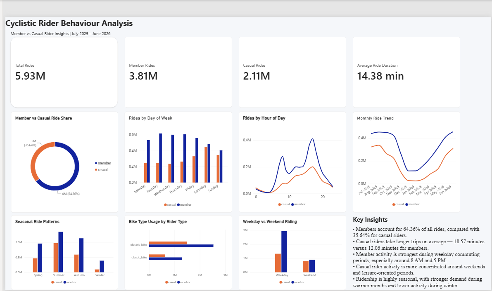

# Cyclistic Rider Behaviour Analysis

## Project Overview

This project analyses approximately **5.93 million Cyclistic bike-share trips** covering **July 2025 to June 2026** to identify behavioural differences between annual members and casual riders.

The project follows an end-to-end data analytics workflow, using **Python and pandas** for data preparation, cleaning and exploratory analysis, followed by **Power BI, Power Query and DAX** for dashboard development and business insight communication.

The analysis explores ride volume, trip duration, day-of-week behaviour, hourly patterns, monthly trends, seasonality, bike-type usage and weekday versus weekend behaviour.

---

## Business Objective

The objective of this project is to understand how **members and casual riders use the Cyclistic bike-share service differently**.

The analysis addresses questions such as:

- What proportion of rides comes from members versus casual riders?
- Which rider group takes longer trips?
- Which days of the week are most popular?
- At what times of day does demand peak?
- How does ridership change throughout the year?
- How does bike-type usage differ between rider groups?
- How does weekday behaviour compare with weekend behaviour?
- What seasonal patterns influence demand?

---

## Dashboard Preview



---

## Key Performance Indicators

| Metric | Result |
|---|---:|
| Total Rides | 5.93M |
| Member Rides | 3.81M |
| Casual Rides | 2.11M |
| Member Ride Share | 64.36% |
| Casual Ride Share | 35.64% |
| Overall Average Ride Duration | 14.38 minutes |
| Member Average Ride Duration | 12.06 minutes |
| Casual Average Ride Duration | 18.57 minutes |

---

## Key Findings

### 1. Members account for most rides

Members generated **3,814,623 rides**, representing **64.36%** of all journeys.

Casual riders generated **2,112,047 rides**, representing **35.64%**.

This indicates that annual members represent the largest proportion of recurring bike-share activity.

### 2. Casual riders take longer trips

Casual riders recorded an average ride duration of approximately **18.57 minutes**, compared with **12.06 minutes** for members.

This suggests that casual riders are more likely to use the service for longer, leisure-oriented journeys.

### 3. Members show strong commuting behaviour

Member activity shows clear weekday commuting patterns.

Notable usage peaks occur around:

- **8 AM**
- **5 PM**

The strong morning and evening peaks suggest that many members use the service for commuting and other routine journeys.

### 4. Casual riders show stronger leisure behaviour

Casual rider activity is relatively more concentrated around weekends and non-commuting periods.

This indicates greater recreational and leisure-oriented usage compared with members.

### 5. Ridership is seasonal

Demand increases significantly during warmer periods and falls during winter.

The seasonal pattern is visible across both member and casual rider groups, although casual ridership experiences greater variation.

### 6. Monthly demand changes substantially throughout the year

The monthly analysis shows a strong decline during the colder months followed by increasing ridership through spring and into summer.

This demonstrates the importance of seasonality when interpreting bike-share demand.

---

## Business Recommendations

Based on the analysis, Cyclistic could consider:

1. Targeting frequent casual riders with membership promotions during high-demand spring and summer periods.
2. Developing weekend-focused campaigns for casual riders who demonstrate stronger leisure usage.
3. Promoting membership benefits around convenience, frequent usage and commuting.
4. Using time-of-day segmentation to target riders during periods of high demand.
5. Adapting promotional strategies according to seasonal changes in ridership.
6. Identifying high-frequency casual riders as potential candidates for membership conversion campaigns.

---

## Data Preparation

The project combined 12 months of trip data into a single analytical dataset.

Key preparation activities included:

- Combining monthly datasets
- Removing duplicate records
- Validating timestamps
- Calculating ride duration
- Investigating invalid and extreme ride durations
- Creating weekday features
- Creating hourly features
- Creating monthly features
- Creating seasonal classifications
- Creating weekday/weekend classifications
- Validating rider categories
- Exporting cleaned data for downstream analysis
- Generating aggregated datasets for Power BI

The cleaned dataset contained approximately **5.93 million valid rides**.

---

## Exploratory Data Analysis

Exploratory analysis was carried out in Python to understand:

- Rider distribution
- Average and median ride duration
- Day-of-week patterns
- Hourly riding patterns
- Monthly trends
- Seasonal behaviour
- Bike-type preferences
- Weekday versus weekend usage

The analysis was then translated into an interactive Power BI dashboard.

---

## Power BI Dashboard

The Power BI dashboard contains the following visuals:

- Total Rides KPI
- Member Rides KPI
- Casual Rides KPI
- Average Ride Duration KPI
- Member vs Casual Ride Share
- Rides by Day of Week
- Rides by Hour of Day
- Monthly Ride Trend
- Seasonal Ride Patterns
- Bike Type Usage by Rider Type
- Weekday vs Weekend Riding
- Key Insights

Consistent visual formatting was used throughout the dashboard:

- **Member riders:** Blue
- **Casual riders:** Orange

---

## Tools & Technologies

- **Python**
- **Pandas**
- **Jupyter Notebook**
- **Power BI**
- **Power Query**
- **DAX**
- **CSV**
- **Parquet**
- **Git**
- **GitHub**
- **Visual Studio Code**

---

## Project Structure

```text
04_analysis/
│
├── images/
│   └── cyclistic_powerbi_dashboard.png
│
├── outputs/
│   ├── bike_type_summary.csv
│   ├── kpi_summary.csv
│   ├── rider_summary.csv
│   ├── rides_by_day.csv
│   ├── rides_by_hour.csv
│   ├── rides_by_month.csv
│   ├── season_summary.csv
│   └── weekend_summary.csv
│
├── powerbi/
│   └── Cyclistic_Rider_Behaviour_Dashboard.pbix
│
├── 01_data_preparation.ipynb
├── 02_data_cleaning.ipynb
├── 03_exploratory_analysis.ipynb
└── README.md